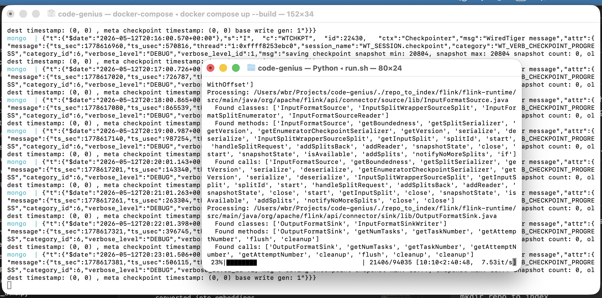
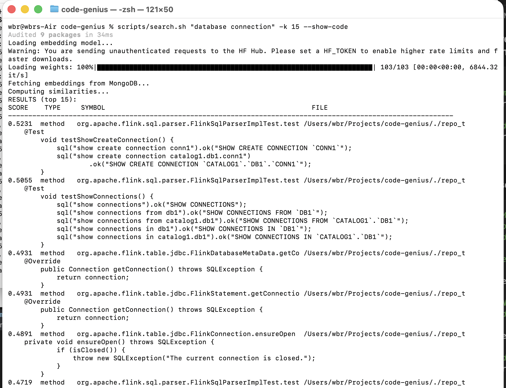

# Code Genius Indexer

## RAG for codebases


This is an offline indexing engine that builds a semantic (embeddings) and structural (graph) representation of a codebase for later retrieval and analysis (also AI-powered ).

This project scans a codebase in a specified folder, generates embeddings for code fragments, stores them in **Qdrant**, and builds a **Neo4j graph** representing method calls. These embeddings and the graph can later be used to enhance code operations, including LLM-powered analysis.

---

## Features

- Extracts classes, methods, and method calls from Java code.
- Generates embeddings for code fragments using a transformer model.
- Stores embeddings in Qdrant for vector search, with code metadata kept in point payloads.
- Builds a method-call graph in Neo4j.
- Fully containerized using Docker for easy setup.

---

## Setup & Usage
This setup was tested with macOS. Linux should work as well.

### 1. Add your code

Create a folder to put a big repo in:
```
mkdir repo_to_index
cd repo_to_index 
```
Place all the code you want to scan in the folder:
```text
repo_to_index/
Each file inside this folder will be processed and converted into embeddings.
```
for example:
```bash
git clone https://github.com/apache/flink.git
```

### 2. Start Qdrant and Neo4j services with Docker

```bash
docker compose up --build
```

This will start:

- Qdrant
- Neo4j

### 3. Run the indexer

```bash
chmod +x scripts/*.sh
./scripts/run.sh
```

This process can take regarding of hardware and repo from couple of minutes to several hours. Macbook M1 8GB took about 40 minutes for flink repo.

### 4. Ask questions about your code

### 5. Optionally inspect embeddings in Qdrant

Open the Qdrant dashboard:
```bash
open http://localhost:6333/dashboard
```

Or print a small terminal preview:
```bash
python tools/qdrant_summary.py
```

### 6. Neo4j Graph

- Neo4j runs on ports 7474 (HTTP) and 7687 (Bolt).

- Method-call relationships are stored in a graph for relational queries.

#### Configuration

- Embedding Model: Uses all-MiniLM-L6-v2 (lightweight, fast).
- Throttle Requests: EMBEDDING_BATCH_DELAY controls delay between embedding requests to reduce CPU/RAM usage.

You can change these in main.py if needed.

#### Notes

- Fully modular: you can replace the embedding model with any sentence-transformers compatible model.
- Ideal for LLM-powered code operations, analysis, or search.

---

## Local development with uv (recommended)

You can run the indexer locally without affecting your system Python by using the uv package manager and helper scripts.

### Prerequisites

- bash, curl
- Python 3.11+ installed (uv will manage the virtualenv)
- Qdrant and Neo4j running locally or reachable via network
  - Defaults: `QDRANT_URL=http://localhost:6333`, `NEO4J_URI=bolt://localhost:7687`, `NEO4J_USER=neo4j`, `NEO4J_PASSWORD=test`

### 1) Make scripts executable (first time only)

```bash
chmod +x scripts/*.sh
```

### 2) Set up the environment

This will install `uv` if missing, create `.venv/`, and install Python dependencies from `requirements.txt`:

```bash
scripts/setup.sh
```

### 3) Configure (optional)

By default, the scanner reads code from `repo_to_index/` at the project root. You can override paths and connections via a `.env` file:

```bash
cat > .env << 'EOF'
# Where your source code to index lives (absolute path or project-relative)
REPO_FOLDER=./repo_to_index

# Qdrant connection
QDRANT_URL=http://localhost:6333

# Neo4j connection
NEO4J_URI=bolt://localhost:7687
NEO4J_USER=neo4j
NEO4J_PASSWORD=test
EOF
```

### 4) Run the indexer

```bash
scripts/run.sh

# Force a full re-scan (ignores MD5 cache and re-indexes all .java files)
scripts/run.sh --full-rescan
```

Notes:
- The script will source `.env` if present and fall back to reasonable defaults.
- To change the code folder without `.env`, export `REPO_FOLDER` before running: `export REPO_FOLDER=/abs/path/to/repo`.
- The scanner skips unchanged files using an MD5 hash cache stored in the Qdrant `file_hashes` collection.
- The indexer strips leading license headers (e.g., Apache ASF banners) from code before storing it in Qdrant.

---

## Semantic search (find interesting code by meaning)

After you have embeddings in Qdrant, you can search for semantically similar fragments using a natural language or code-like query.

### Quick start

```bash
# Find the top 10 most relevant fragments for your query
scripts/search.sh "parse json response" -k 10

# Show short code snippets in the results
scripts/search.sh "database connection" -k 15 --show-code

# Include graph context (top 5): callers and callees from Neo4j
scripts/search.sh "job submission" -k 10 --with-graph
```


### What it does

- Encodes your query using the same embedding model (`all-MiniLM-L6-v2`).
- Queries Qdrant's `code_memory` collection and prints a ranked list.
- If `--with-graph` is provided and Neo4j is reachable, shows for the top 5 results:
  - Callers: methods that call the matched method
  - Calls: methods called by the matched method

### Output format

```
RESULTS (top K):
SCORE    TYPE     SYMBOL                                                   FILE
----------------------------------------------------------------------------------------------
0.6123   method   processOrder                                             repo_to_index/.../Order.java
0.5987   class    JsonUtils                                                repo_to_index/.../JsonUtils.java
```

Use `--show-code` to print the first 8 lines for each match.

Notes:
- `--with-graph` requires a working Neo4j connection (see `.env`).
- The graph currently keys `Method` nodes by method name only (no class scoping), which may cause collisions across classes. We can extend this to include class names if needed.

---

## Resetting data (start from scratch)

Use these commands to clear stored data from Qdrant and Neo4j and re-index from a clean slate.

### One-shot reset (recommended)

```bash
chmod +x scripts/*.sh  # first time only
scripts/reset_all.sh

# Rebuild everything
scripts/run.sh --full-rescan
```

### Manual reset

```bash
# Clear Qdrant collections (code_memory and file_hashes)
python tools/clear_qdrant.py

# Clear Neo4j graph (all nodes and relationships)
python tools/clear_neo4j.py

# Rebuild
scripts/run.sh --full-rescan
```

Notes:
- The reset scripts use the same environment variables as the indexer. Ensure `.env` exports `QDRANT_URL`, `NEO4J_URI`, `NEO4J_USER`, and `NEO4J_PASSWORD`.
- After a reset, the end-of-run summary will show the updated Qdrant totals and Neo4j graph counts.
